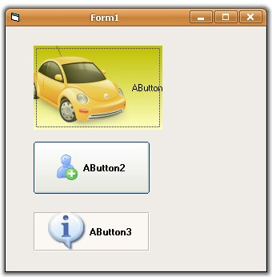



## AniButton Command button wiht png picts

### Description

AniButton = Chamaleon Button reloaded, this control is the conjunction of work of various authors, i added the capacity of load PNG pictures and 32Bpp Icons with the code of FYI(LaVolpe)
 
### More Info
 

             |
---                |---
**Submitted On**   |2007-03-15 14:40:54
**By**             |[Anibal Sarasua](https://github.com/Planet-Source-Code/PSCIndex/blob/master/ByAuthor/anibal-sarasua.md)
**Level**          |Intermediate
**User Rating**    |5.0 (55 globes from 11 users)
**Compatibility**  |VB 6\.0
**Category**       |[Custom Controls/ Forms/  Menus](https://github.com/Planet-Source-Code/PSCIndex/blob/master/ByCategory/custom-controls-forms-menus__1-4.md)
**World**          |[Visual Basic](https://github.com/Planet-Source-Code/PSCIndex/blob/master/ByWorld/visual-basic.md)
**Archive File**   |[AniButton2053943152007\.zip](https://github.com/Planet-Source-Code/anibal-sarasua-anibutton-command-button-wiht-png-picts__1-68143/archive/master.zip)

